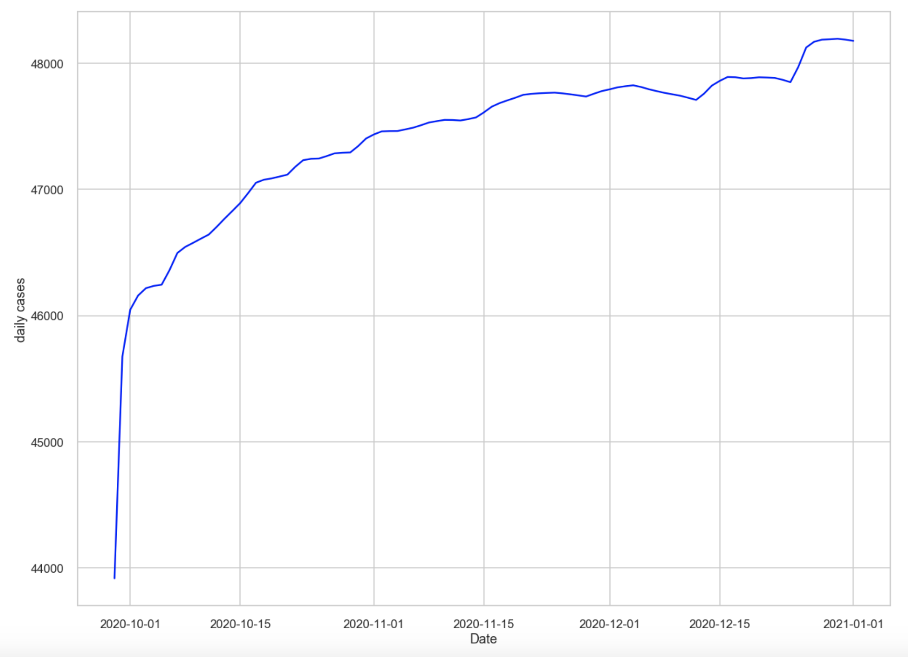

# COVID19FactorAnalysis
An attempt at understanding the factors that influence the spread of COVID-19 and training deep learning models to predict the number of COVID-19 cases, deaths and recoveries.
Read the full article for this project on Medium: https://medium.com/analytics-vidhya/covid-19-analysis-and-forecasting-using-deep-learning-be154ef553bf

## Visualizations

### Confirmed Cases (7/20/20)

### Deaths (7/20/20)

### Recovered Cases (7/20/20)

<<<<<<< HEAD

## Forecasts

### Daily Cases Forecast for the U.S. Assuming No Policy Changes

